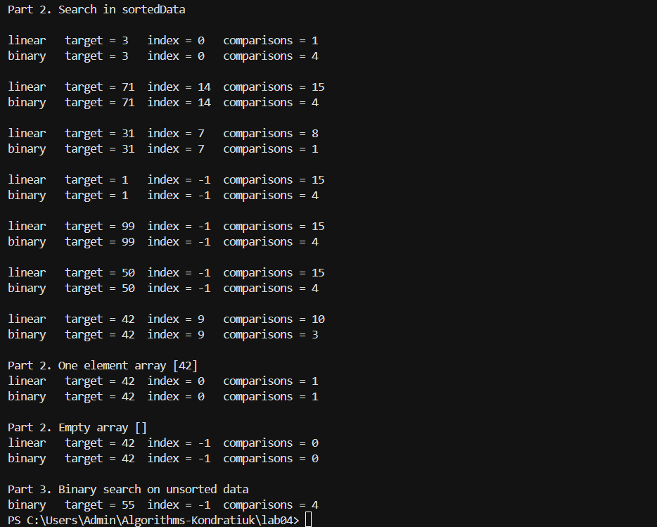

# Лабораторна робота №4
## Пошук у даних

**Дисципліна:** Алгоритми та структури даних  
**Група:** ІПЗ-3/1  
**Студентка:** Кондратюк Дарина  
**Мова програмування:** C#

## Мета роботи

Реалізувати лінійний і бінарний пошук власноруч та перевірити їх роботу на впорядкованих і невпорядкованих даних.

## Хід роботи

### 1. Реалізація пошуку

Було реалізовано дві функції:

- `LinearSearch` — лінійний пошук;
- `BinarySearch` — бінарний пошук.

Обидві функції повертають індекс знайденого елемента або `-1`, якщо елемент не знайдено.

Для підрахунку кількості порівнянь використовується змінна `comparisons`.

### 2. Перевірка

Обидва алгоритми було перевірено на відсортованому масиві:

```text
[3, 5, 8, 12, 19, 24, 27, 31, 37, 42, 49, 55, 60, 68, 71]

